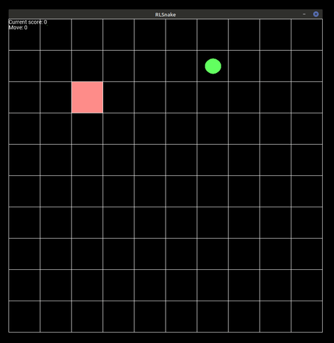

# RLSnake

[](https://github.com/torlenor/rlsnake/actions?query=workflow%3A%22Build+and+Test%22)
[](/LICENSE)

## Description

An implementation of the classic game Snake and an environment to use to use in reinforcement learning. An actor-critic agent with a pre-trained model is provided.

It is not the cleanest Python project, but it solves its purpose and hopefully someone can use parts of it or finds it interesting.

<p align="center">
  
</p>

## Requirements

- Python 3.6–3.8
- numpy (tested with 1.18.5)
- OpenAI Gym (tested with 0.17.3)
- tensorflow (tested with 2.3.0)
- tensorflow_probability (tested with 0.11.1)
- PySdl2 (for the graphical representation)

See *the requirements.txt* file for detailed Python requirements or use
```bash
pip install -r requirements.txt --user
```
to install them (note: you may have to use `pip3` on Ubuntu).

You may need to install the sdl2 libraries and development files appropriate for the operating system. On Ubuntu-based distributions you can type
```bash
sudo apt-get install libsdl2*-dev
```
to install them.

## Environment

The game (rlsnake/game) is encapsulated in an environment inspired by the OpenAI Gym environments. You should be able to use the environment (rlsnake/env) in programs using such environments. However, currently you have to instantiate the environment yourself, using

```python
from rlsnake.envs.rlsnake_env_v1 import RlSnakeEnvV1

env = RlSnakeEnvV1(args.x, args.y, args.visibility_range)
env.seed(RANDOM_SEED)
```

## Using the pre-trained model

We provide a pre-trained model which you can use to get you started.

Type
```bash
python3 simulate.py --model-path models/ac_pretrained/model --x 6 --y 6 --seed 123 --autoplay
```
to let the agent play with this model on a 6x6 field.

## Train your own model

To start training your own model, use the train script. For example
```bash
python3 train.py --episodes 100000 --gamma 0.995 --neurons 512 --learning-rate 1e-3 --max-steps 200 --run-id RUN_ID
```

The results, including model checkpoints and the final model, will be stored in the directory *results/RUN_ID*.

### TensorBoard

We write a few training values (reward/episode, running_reward, moves/episode) into TensorBoard data files. Type
```bash
tensorboard --logdir results/
```
to launch a TensorBoard instance and then follow the output to view the training values in real time.

## Play as human

We provide a simple implementation to try out the game as a human. In contrast to the original snake, it is turn based, i.e., every time you take an action it will perform that action and wait for you to take the next step. While this takes away the stress of the original Snake, it does not matter much for reinforcement learning, as it is always possible to map one time step of the game onto one observation for the model and get back the action to apply to the game.

Type
```bash
python3 play.py
```
to start playing. Use your arrow keys on the keyboard to move around. You can pass the parameters `--x NUMBER_OF_HORIZONTAL_TILES` and `--y NUMBER_OF_VERTICAL_TILES` to change the size of the field.
